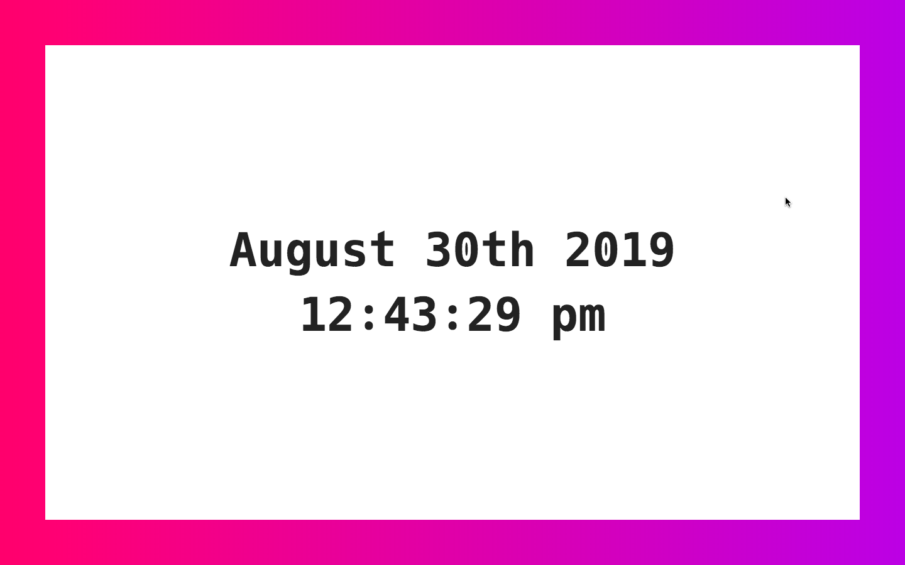
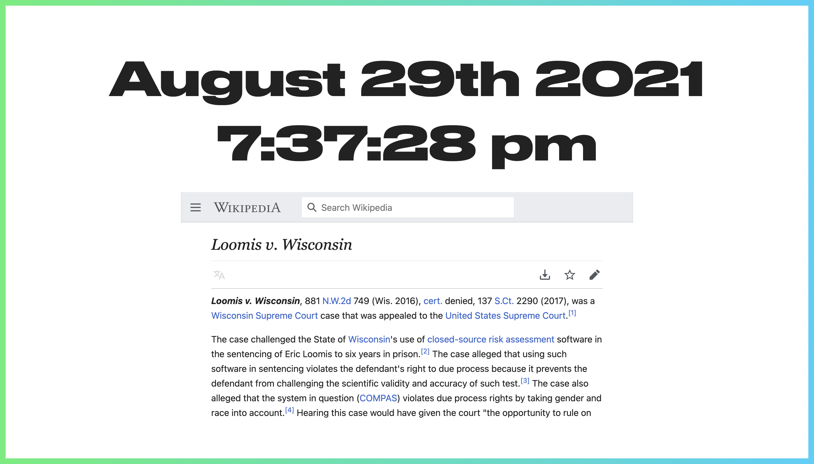
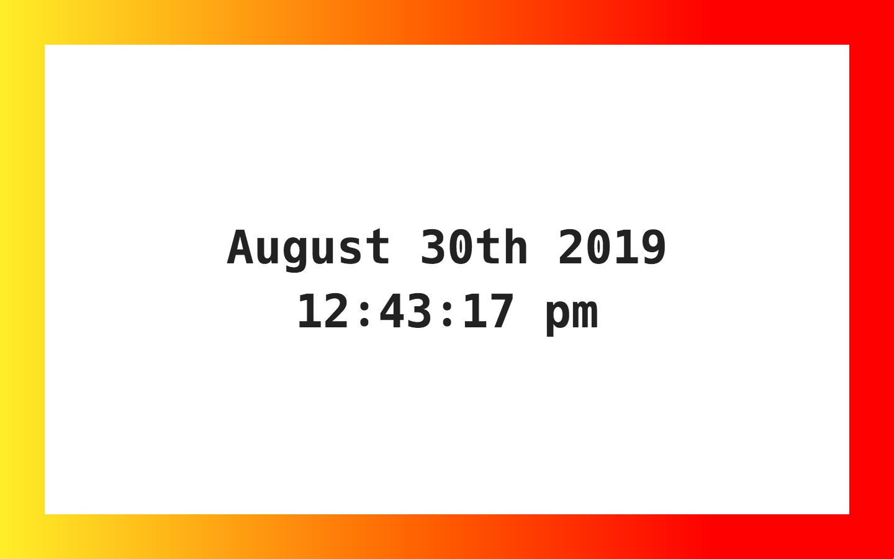
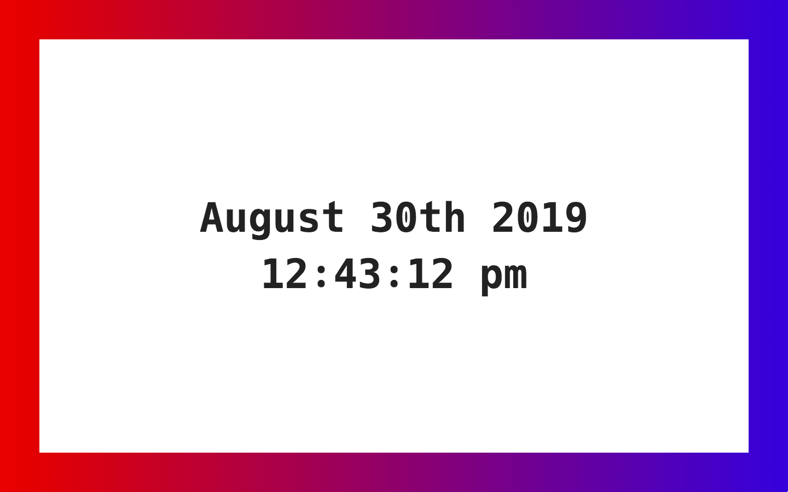

# Startpage

> A custom start page for chrome

For some reason Currently stopped working for me so I created this to use instead. It just gives you the date and the time, with one of 5 possible background colors.

## To use

Clone the repo, `npm install`, `npm run build`, and then [follow the instructions here](https://superuser.com/a/909595). You'll need to have 'Hack' font installed locally, or just change the font in `scss/_main.scss`.

## Examples

