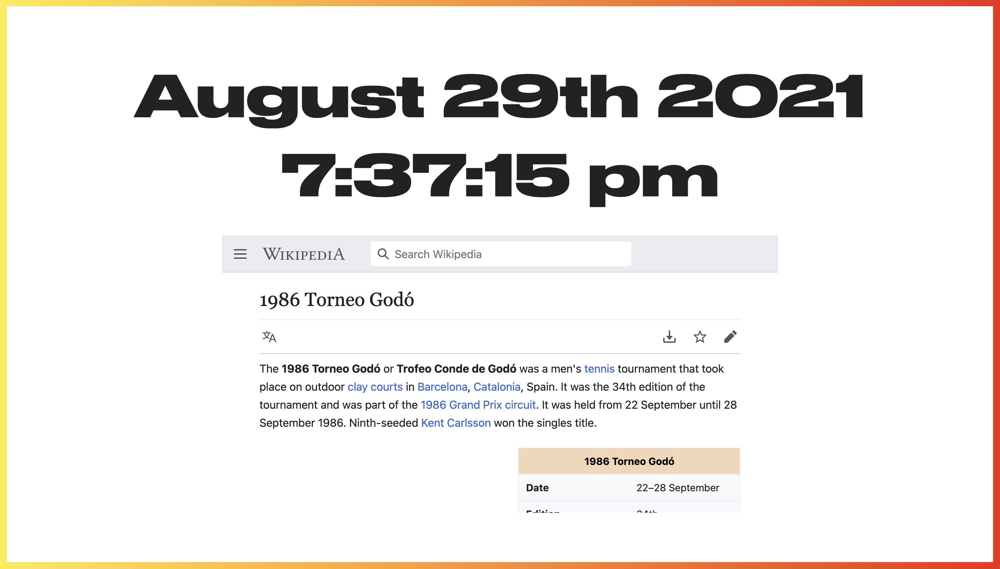

# Startpage

> A custom start page for chrome

Shows the time and a random wikipedia article when you open up a new tab in Chrome.

## To use

Clone the repo, `npm install`, `npm run build`, and then [follow the instructions here](https://superuser.com/a/909595). You'll need to have 'Hack' font installed locally, or just change the font in `scss/_main.scss`.

## Examples

